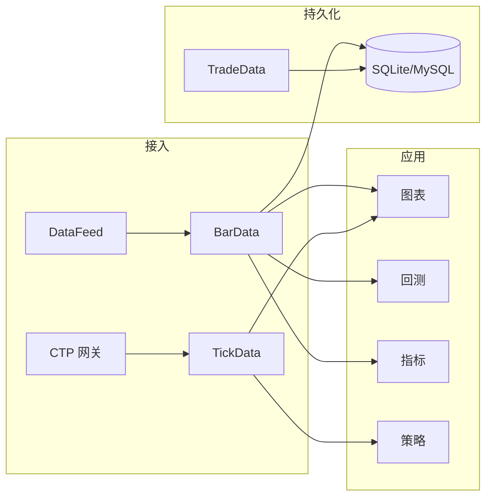

# 数据架构（ATMQuant）

## 元信息

| 属性     | 值   |
|----------|------|
| 最后更新 | 2025-03-15 |
| 关联文档 | [业务视角](knowledge/business/README.md)、[技术视角](knowledge/technical/README.md) |

## 数据存储全景

| 存储/来源       | 类型     | 用途             | 所属模块     | 说明文档 |
|-----------------|----------|------------------|--------------|----------|
| vnpy 本地/MySQL | SQLite/MySQL | 合约、Bar、Tick、Trade、持仓等 | vnpy_datamanager / 各 App | 见 vnpy 文档 |
| 配置文件        | .env / YAML | 运行配置、数据源、网关、告警 | config       | .env.example |
| 日志文件        | 文件系统 | 运行日志、告警记录 | core/logging | docs/logging-system.md |
| 数据源 API      | Tushare/AKShare 等 | 历史 K 线、行情 | core/data、vnpy_* | docs/akshare_datafeed.md |

## 核心数据实体（逻辑）

与 vnpy 及 ATMQuant 代码对应：

| 实体概念   | 说明 | 主要使用处 |
|------------|------|------------|
| BarData    | K 线（OHLCV + 周期） | 图表、回测、指标计算 |
| TickData   | Tick 行情           | 实盘、部分数据源 |
| TradeData  | 成交记录           | 策略、回测结果 |
| PositionData | 持仓               | 策略、交易面板 |
| ContractData | 合约信息           | 数据管理、交易 |
| 策略参数/状态 | 策略配置与运行时状态 | vnpy_ctastrategy、回测 |

## 数据流概览

## 扩展说明

- 新增 **数据存储** 时：在 `data/` 下新建 `{DS-ID}/`，在本文「数据存储全景」中补充。
- 新增 **数据实体** 时：在对应 DS 目录下用 `schema/{ENT-ID}.yaml` 描述，并可通过 `maps_to_aggregate_id` 关联业务聚合。
