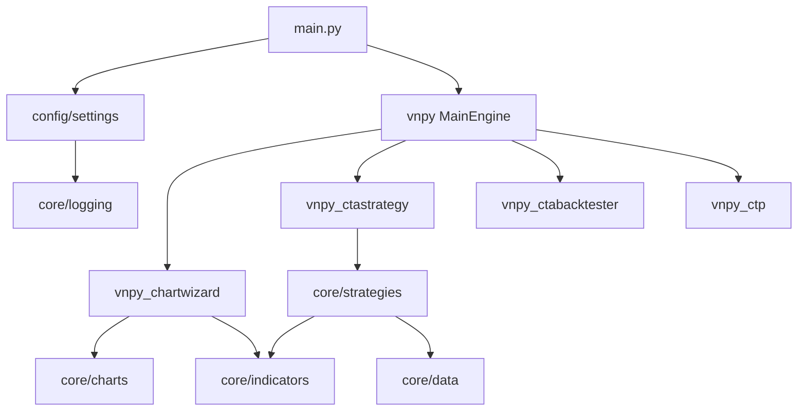

# 系统架构（ATMQuant）

描述技术视角下 **ATMQuant 系统** 的职责、边界及与各模块的关系。实现细节见各应用目录与代码仓库 `core/`、`config/`、`vnpy_*`。

---

## 元信息

| 属性     | 值   |
|----------|------|
| 最后更新 | 2025-03-15 |
| 关联文档 | [技术视角 README](README.md)、[SYS-ATMQUANT](SYS-ATMQUANT/README.md) |

---

## 系统清单

| 系统 ID        | 系统名称       | 职责概要 | 边界说明 | 目录 |
|----------------|----------------|----------|----------|------|
| SYS-ATMQUANT   | ATMQuant 交易系统 | 基于 vnpy 的量化交易桌面应用：图表、指标、策略、回测、数据与配置、日志告警 | 单体应用；含 vnpy 及 CTP/数据源等插件；不含云端服务 | [SYS-ATMQUANT](./SYS-ATMQUANT/) |

---

## 系统职责与边界

### SYS-ATMQUANT（ATMQuant 交易系统）

- **职责**
  - 对外：通过 CTP 等网关连接交易所；通过 Tushare/AKShare 等获取行情与历史数据。
  - 对内：在进程内完成图表展示、指标计算、策略执行、回测、配置与日志告警；依赖 vnpy 事件引擎与主引擎。
- **边界**
  - **包含**：`core/`（charts、indicators、data、logging、strategies）、`config/`、`vnpy_chartwizard`、`vnpy_ctastrategy`、`vnpy_ctabacktester`、`vnpy_ctp`、`vnpy_tqsdk`、`vnpy_datamanager` 等；主入口 `main.py`。
  - **不包含**：独立的后台服务、第三方实盘/模拟交易系统实现细节（仅通过 vnpy 网关对接）；数据归属与运行边界以本进程为界。
- **与外部关系**
  - 依赖 vnpy 生态与 CTP/TQSDK 等接口；数据源与配置通过 `.env` 与 `config/settings.py` 管理。

---

## 子系统划分（SYS-ATMQUANT 内部）

按 **功能模块** 划分，与业务子域对应。

| 子系统     | 职责 | 主要代码路径 | 对应业务子域 |
|------------|------|--------------|--------------|
| 图表       | K 线展示、双图/四图、光标与视口、与 ChartWizard 集成 | `core/charts/`、`vnpy_chartwizard/` | BSD-CHART |
| 指标       | 技术指标实现、动态加载、无头计算器 | `core/indicators/` | BSD-INDICATOR |
| 策略与回测 | 策略基类、回测引擎、CTA 策略/回测 App | `core/strategies/`、`vnpy_ctastrategy/`、`vnpy_ctabacktester/` | BSD-STRATEGY |
| 数据与配置 | 配置加载、数据源、Bar/Tick、合约与下载 | `core/data/`、`config/` | BSD-DATA |
| 日志告警   | 日志管理、告警推送 | `core/logging/`、`config/alert_config.py` | BSD-LOGGING |

---

## 模块依赖关系（概览）

---

## 扩展说明

- 新增 **系统** 时：在本目录下新建 `{SYS-ID}/`，在本文「系统清单」与「系统职责与边界」中补充。
- 新增 **应用/模块** 时：在 SYS-ATMQUANT 下补充说明，并同步业务视角的 `implemented_by_app_id`。
